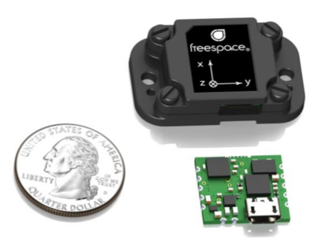

# Freespace FSM-9 IMU ROS Node
### Jordan Ford
This is an unofficial ROS node for the [FSM-9](https://www.hillcrestlabs.com/products/fsm-9) Inertial Measurement Unit (IMU) from [hillcrestlabs](https://www.hillcrestlabs.com).




### ROS install
Install libfreespace e.g.:
```
cd ~
git clone https://github.com/hcrest/libfreespace
cd libfreespace/
mkdir build; cd build
cmake ../
make
sudo make install
```

After that catkin build or catkin_make the fsm_imu package:
```
cd ~/catkin_ws/src/
git clone https://github.com/jsford/fsm_imu
catkin build fsm_imu
source ~/.bashrc
```

Make sure you have `a+w` permission, first check with `lsusb` e.g.:

```
$ lsusb

Bus 001 Device 008: ID 1d5a:c0e0 
```

```
sudo chmod a+w /dev/bus/usb/001/008
```